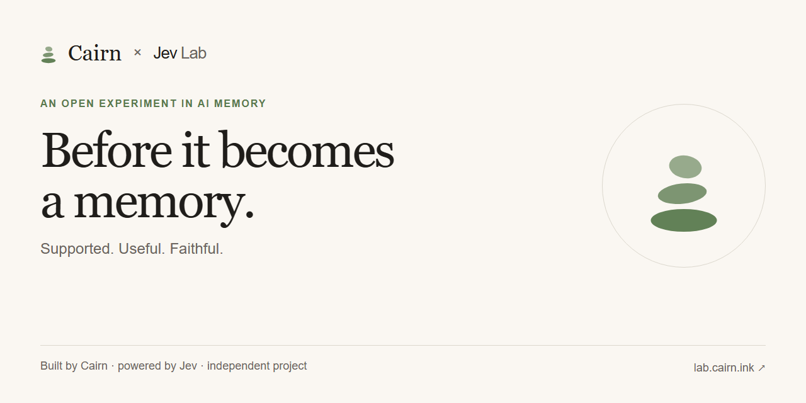
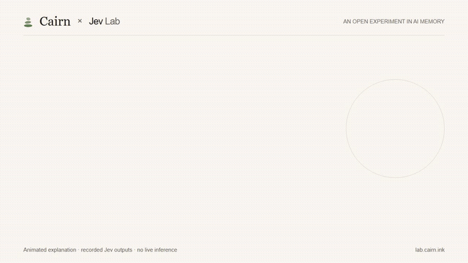
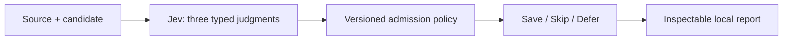

# Cairn Jev Lab

**Test what your AI should remember.**

### [Explore the lab → lab.cairn.ink](https://lab.cairn.ink/)

Browse published results and replay recorded examples. No setup, account, or API key needed.

[](https://lab.cairn.ink/)

[](https://github.com/Cairn-ink/cairn-jev-lab/actions/workflows/test.yml)
[](LICENSE)

[Public demo](https://lab.cairn.ink/) · [Quick start](#quick-start) · [Bring your own cases](#try-your-own-cases) · [Policy](docs/policy.md) · [Jev vs Luna results](evidence/comparison-openai-v1/README.md) · [Contributing](CONTRIBUTING.md) · [繁體中文](docs/zh-TW/README.md)

Cairn Jev Lab is an experimental memory admission evaluator. Give it a source passage and a proposed memory. Jev evaluates the evidence; a small, inspectable policy recommends **save**, **skip**, or **defer**.

Use it to test a memory policy before letting it decide what an agent keeps. The lab includes editable cases, a reusable JavaScript entry point, and reports that retain both successful judgments and mistakes. Node.js 22+, no runtime dependencies.

> **Developer preview.** A paired Jev/Luna study now covers 100 synthetic admission cases and 20 follow-up questions. At threshold .40, Jev saved 39/50 intended memories and Luna saved 41/50; both observed zero false saves among 50 non-save labels. Labels were AI-authored without independent human review. This is an experiment, not a production quality claim.

## Why this exists

A memory can sound plausible while changing what someone actually said:

| Source | Proposed memory | Intended decision |
|---|---|---|
| “I prefer concise answers across conversations.” | “The user prefers concise answers.” | Save |
| “Use English for this reply.” | “The user always prefers English.” | Skip |
| “We might try PostgreSQL; nothing is decided.” | “The team adopted PostgreSQL.” | Skip |
| “Let's do what we discussed earlier.” | “The user approved the original plan.” | Skip: approval is not established |

These are policy examples, not observed model outputs. Defer means an unresolved assessment without a confident rejection; it does not excuse invented details. See the [boundary audit](docs/decision-boundary.md) and [what comes next](#what-comes-next).

This project makes three things inspectable:

- **The standard:** separate source support, future usefulness, and preservation of commitment or uncertainty.
- **The decision:** retain Jev's choices, probabilities and confidence alongside the deterministic policy reason.
- **The tradeoff:** count false saves, missed saves and deferrals against your own expected labels, with per-case latency and token usage.

You supply the source and candidate. The lab does not extract memories, rewrite text, store long-term memory, retrieve it, or delete it. A `save` result is a recommendation, not proof that a claim is true.

## Quick start

The [public lab](https://lab.cairn.ink/) is recorded-only: visitors cannot submit new live evaluations. To test your own text, run the lab locally with your own TypeSafe key.



### How this relates to Cairn Memory

[Cairn Memory](https://github.com/Cairn-ink/cairn-memory) is the memory project; this lab investigates the admission decision before storage. The current lab does not write to Cairn Memory. An integration would need an explicit adapter and validation before any production memory writes.

Want a visual walkthrough? After cloning, run `node src/server.mjs` and open **http://127.0.0.1:4175/**. Four recorded cases need no key and make no API calls. To evaluate your own text, start with `node --env-file=.env src/server.mjs` instead. The key stays on the local server. See the [playground guide](docs/playground.md).

```sh
git clone https://github.com/Cairn-ink/cairn-jev-lab.git
cd cairn-jev-lab
node --test
node src/cli.mjs
```

The preview validates and displays 20 English development cases. It needs no key, installs nothing, and makes no API calls. The npm equivalents are `npm test` and `npm run preview`.

To run Jev, copy `.env.example` to `.env` and set `TYPESAFE_API_KEY` locally. Then start with the four-case sample:

```sh
node --env-file=.env src/cli.mjs --live --input examples/my-cases.json
```

Run the full English development set:

```sh
node --env-file=.env src/cli.mjs --live --limit 20
```

An existing environment variable works too; omit `--env-file` in that case. To use a key file outside the repo, pass its path to `--env-file`. See [TypeSafe's quick start](https://docs.typesafe.ai/introduction/quickstart) for API access.

## Try your own cases

Create a JSON array like [examples/my-cases.json](examples/my-cases.json):

```json
[
  {
    "id": "language-preference",
    "source": "Please use English in future conversations.",
    "candidate": "The user prefers English replies.",
    "expected": "save"
  }
]
```

`expected` is optional. Include it to measure agreement with your policy; leave it out to inspect recommendations. Expected labels and optional `why` notes are never sent to Jev.

```sh
node src/cli.mjs --input examples/my-cases.json
node --env-file=.env src/cli.mjs --live --input examples/my-cases.json
```

Input files contain 1–20 cases. Every case is validated before any API request. See the [input and report guide](docs/testing.md) for limits and metrics. Use `node src/cli.mjs --help` for options.

## Use from JavaScript

From this checkout:

```js
import { judgeMemory } from './src/index.mjs';

const result = await judgeMemory({
  source: 'We are considering PostgreSQL, but have not decided.',
  candidate: 'The team has adopted PostgreSQL.'
}, { apiKey: process.env.TYPESAFE_API_KEY });

console.log(result.decision); // 'save', 'skip', or 'defer'; model-dependent
console.log(result.reason);   // deterministic policy reason, not generated prose
console.log(result.answers);  // each judgment with probabilities and confidence
```

This makes one real API call. The source and candidate are returned unchanged; no memory store is touched. This repo is not published as an npm package. The API is experimental.

## How decisions work



One request asks three independent Choice questions:

| Dimension | Question |
|---|---|
| Support | Does the source support the candidate without changing actor, scope, time or certainty? |
| Durability | Would this information likely help in a future session? |
| Commitment | Does the candidate preserve proposals, reports, conditions and uncertainty? |

The `admission-v1` policy uses a provisional confidence threshold of `0.75`. A confident negative judgment causes `skip`; remaining uncertain assessments cause `defer`; all three positive, sufficiently confident judgments produce `save`. Confidence is not a guarantee of accuracy. See [the exact rule and its limits](docs/policy.md).

## What we have measured

### Latest: Jev / Luna admission and follow-up answers

We completed **260 live calls**: 100 Jev judgments, 100 Luna judgments and 60 Luna reader calls shared across 20 follow-up questions. Luna uses `gpt-5.6-luna` with reasoning effort `none`; both gates use the same three criteria.

| On the same 100 cases | Jev at .40 | Luna at .40 |
|---|---:|---:|
| Intended memories saved | 39 / 50 | 41 / 50 |
| False saves among non-save labels | 0 / 50 | 0 / 50 |
| Deferred | 8 | 0 |
| Median gate latency | 250 ms | 1,593 ms |

In the 20 follow-ups, save-all caused 10 wrong answers. Both .40 gates avoided those wrong answers, but Jev left eight answerable questions unanswered and Luna left ten. The reader, questions and options stayed fixed. This selected, AI-authored pilot exposes the tradeoff between rejecting bad memories and retaining useful ones; it does not establish a general model ranking. Thresholds are not calibration-equivalent and latency includes network time.

[Full report and figures](evidence/comparison-openai-v1/README.md) · [Frozen protocol](evidence/comparison-openai-v1/PROTOCOL.md) · [Exact requests and results](evidence/comparison-openai-v1/report.json)

Audit the evidence with `node scripts/verify-openai-evidence.mjs` (no calls). To repeat, set `TYPESAFE_API_KEY` and `OPENAI_API_KEY` locally and run `node --env-file=.env scripts/compare-openai.mjs --live` (maximum 260 calls, no automatic retries). The public demo continues to show the separate original Jev-only study below.

### Original 100-case English study

We froze 100 new source/candidate pairs, labels and the evaluation protocol before calls. Five categories cover preferences and scope, speaker attribution, proposals and decisions, conditions and uncertainty, and corrections. Every case was evaluated once with unchanged questions and policies.

| Metric | Baseline: 0.75 | Preview: 0.40 |
|---|---:|---:|
| Matches expected decision | 59 / 100 | 78 / 100 |
| Intended memories saved | 18 / 50 | 38 / 50 |
| False saves among 50 non-save cases | 0 | 0 |
| Expected deferrals correctly deferred | 1 / 10 | 0 / 10 |

All 100 calls completed. Mean response time was **264 ms**, median **246 ms**, p95 **346 ms**. These client-observed times include network; they are not a production speed guarantee.

The preview saved more intended memories, but its handling of missing context did not match our defer rubric. Rejecting an unsupported candidate can also be defensible: the labeling boundary needs independent review. These are AI-authored synthetic labels, not two-human consensus or an independent benchmark. Do not compare this 78% with the earlier 73% as a longitudinal improvement; the datasets differ.

**Post-result label audit:** all ten defer-labeled candidates add unsupported specificity or certainty. Under candidate-level source fidelity, their skips are defensible; this exposes an overlap in our original rubric, not ten established model failures. The original scores remain unchanged. Read the [skip/defer boundary review](docs/decision-boundary.md) for all ten cases, contrasting examples and the limits of this same-author review.

[Full report, confusion matrices and every disagreement](evidence/coverage-en-v1/README.md) · [Frozen rubric](evidence/coverage-en-v1/PROTOCOL.md) · [100-case manifest](fixtures/coverage-en-v1/manifest.json)

Validate the suite with `node scripts/coverage.mjs` (no calls). To repeat with your own key: `node --env-file=.env scripts/coverage.mjs --live` (up to 100 calls, no retries, stop on first error). The ordinary CLI remains bounded to 20 cases; each category file can be used with its `--input` option.

### Repeatability and response time

We subsequently repeated the same English set twice without changing labels, questions or policies: **20 unique cases, three passes, 60 evaluations**. Preview agreement was 15/20, 15/20 and 14/20; pooled agreement was 44/60 versus baseline 33/60. Preview saved 16/30 intended-save observations and missed 14/30. Two cases changed preview decisions across passes. Repeats are correlated observations, not new independent examples.

Mean client-observed response time was **289 ms**, median **271 ms**, and nearest-rank p95 **363 ms**, including all requests and network time. This is not a production speed guarantee. [Full repeatability evidence](evidence/repeat-en-v1/README.md).

The landing page now presents the separate 100-case study, with category comparisons and response times above **Try it yourself**. `node scripts/build-study.mjs` regenerates the latest dashboard and both study summaries from published responses without API calls. The earlier repeatability data remains in `evidence/repeat-en-v1/study.json`. Recorded examples still come from the original English pilot and work in a static copy of `web/`; new evaluations require the local server and your own key. See [the playground and distribution guide](docs/playground.md).

### Fresh English comparison

We replayed the original responses offline, selected a preview threshold of `0.40`, and froze the policy and 20 new English cases before calling Jev. Both policies then used the **same 20 responses**, with unchanged questions and `jev-1.13.0`.

| Metric | Baseline: 0.75 | Preview: 0.40 |
|---|---:|---:|
| Matches expected decision | 11 / 20 | 15 / 20 |
| Intended memories saved | 2 / 10 | 6 / 10 |
| False saves among 10 non-save cases | 0 | 0 |
| Deferred | 11 | 7 |

The preview recovered four useful memories, but still missed four. Zero false saves in ten examples is limited evidence. These fresh cases share authors and categories with development cases; they are not an independent benchmark. **Baseline remains the default.**

[Full comparison and failures](evidence/holdout-en-v1/README.md) · [Frozen protocol](evidence/holdout-en-v1/PROTOCOL.md) · [Exact responses](evidence/holdout-en-v1/report.json) · [Offline threshold replay](evidence/threshold-replay-v1/README.md)

To opt into the preview in the CLI, add `--policy admission-v2-preview`. In JavaScript, pass `policyId: 'admission-v2-preview'` in the options object. Run `node scripts/sweep.mjs` to reproduce the offline threshold analysis without API calls.

### Original development pilot

The [first live pilot](evidence/pilot-2026-09-22/notes.md) used 20 synthetic development cases, primarily in Traditional Chinese, on September 22, 2026. The provider returned `jev-1.13.0`.

| Metric | Observed |
|---|---:|
| Matches expected decision | 13 / 20 |
| Saved / skipped / deferred | 2 / 11 / 7 |
| False saves | 0 / 11 cases not expected to save |
| Missed saves | 7 / 9 cases expected to save |
| Mean request latency | 298 ms |

The policy was too conservative on this small set. These results are not a held-out benchmark, a comparison against Cairn or another model, or a production quality claim. The translated development examples in `fixtures/english.json` remain unmeasured. The separate fresh English evaluation uses `fixtures/holdout-en-v1.json`. Translation does not inherit original results.

[Run report](evidence/pilot-2026-09-22/report.md) · [Exact recorded data](evidence/pilot-2026-09-22/report.json)

## Data, cost and reproducibility

- Live runs send source and candidate text to **TypeSafe** and may incur API charges. Preview and offline tests make no network calls.
- An ordinary CLI run makes at most 20 requests; the dedicated coverage runner permits 100 and the repeatability runner 40. Calls are sequential, with a 30-second timeout and no automatic retries. These runners stop on the first error and retain partial reports. These are request limits, not billing caps.
- `runs/<timestamp>/` contains `report.json` and `report.md`: inputs, question and fixture hashes, requested and returned model versions, decisions, failures, timing and token usage.
- `.env`, `runs/`, and the suggested `local-cases/` directory are ignored by Git. Keep personal test data there. Only reviewed synthetic evidence belongs in `evidence/`.
- CLI/library requests default to `jev-latest`; the playground defaults to `jev-1.13.0`. Set `JEV_MODEL` to a provider-supported version for repeatable configuration. A repeated call may still produce different results.

## Project scope

This lab explores the decision **before a memory is admitted**. [Cairn Memory](https://github.com/Cairn-ink/cairn-memory) remains responsible for receipts, storage, namespaces, revisions, corrections and forgetting. No integration is active yet.

The memory-gate idea was inspired by [jev-memory](https://github.com/NicolasMontone/jev-memory). This is an independent implementation focused on source support, an explicit defer outcome, and published evaluation evidence. It calls the [TypeSafe API](https://docs.typesafe.ai/introduction/quickstart) directly.

## What comes next

**The first live comparative pilot is complete:** [Jev/Luna judgments, latency and follow-up answers](evidence/comparison-openai-v1/README.md). The [earlier offline baseline analysis](evidence/comparison-v1/README.md) remains separate. Our next experiments will examine useful, updateable project state and independently authored cases. [Research context](docs/research-directions.md) connects the findings to earlier work on memory admission.

The first 100 cases surfaced a useful research question: **when should a memory gate reject a claim, and when should it ask for more evidence?** Our next phase turns that question into testable comparisons:

1. **Sharper decision boundaries.** Use the [20 prepared contrast cases](evidence/boundary-review-v1/README.md) to separate invented details from genuinely unresolved context. The planned study includes blind independent review and records disagreements before model evaluation.
2. **Harder cases, clearer tradeoffs.** Add community-authored synthetic cases, investigate speaker attribution and future usefulness, and compare a durability-only policy with the three-question policy. Report missed saves alongside false saves, latency and repeatability.
3. **A path into Cairn Memory.** Explore an opt-in adapter that carries source evidence and admission reasons into a memory workflow. Start with dry-run recommendations and evaluate the policy before enabling writes.

These are planned experiments, not completed results or a committed release schedule. **Bring a case that challenges the policy:** share a synthetic source, proposed memory and expected decision through [CONTRIBUTING.md](CONTRIBUTING.md).

English is the primary documentation language. Translations live in [`docs/zh-TW/`](docs/zh-TW/README.md). Historical source text and recorded results retain their original language.

## License

[MIT](LICENSE). An experimental project by [Cairn](https://github.com/Cairn-ink).
