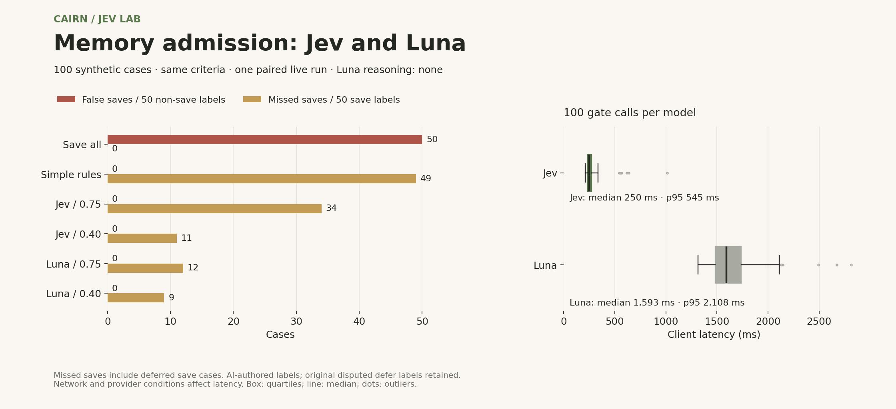
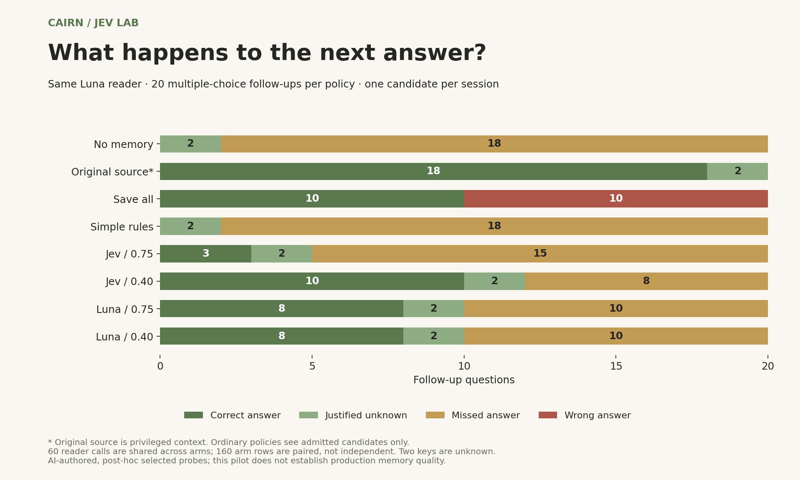

# Jev and Luna: admission, latency and the next answer

Completed: 2026-09-22T11:00:50.685Z. Model: gpt-5.6-luna; Jev: jev-1.13.0. Synthetic, AI-authored labels; one run. Luna uses reasoning effort `none`, temperature 0 and strict structured output.


[Frozen protocol](PROTOCOL.md) · [Every request and result](report.json) · [20 follow-up probes](../../fixtures/downstream-v1.json) · [Research context](../../docs/research-directions.md)

**Observed in this pilot:** Jev had lower gate latency; Luna retained two more of the 50 intended saves at threshold .40. Neither admitted a non-save-labeled case. Admission errors and downstream answers tell different stories, so neither model is declared the overall winner.

- At .40, Jev saved 39/50 intended memories and Luna saved 41/50. Each observed zero false saves among 50 non-save labels. Equal thresholds do not imply equally calibrated confidence.
- Gate median latency: Jev **250 ms**, Luna **1,593 ms**. Mean: 277 vs 1,649 ms. These measurements include network and different response mechanisms; this is one connection and run.
- In 20 follow-ups, save-all caused **10 wrong answers**. Both .40 gates caused **zero wrong answers**, while Jev left eight answerable questions unanswered and Luna left ten. Withholding a bad candidate cannot recover the correct fact that was never stored.



This is a fresh paired run of the original cases, not a replay of the archived Jev responses. It makes 260 calls: 100 Jev gate, 100 Luna gate and 60 Luna reader. All completed with valid output; there were no retries. The older [offline analysis](../comparison-v1/README.md) stays separate.

## Admission

| Policy | Matches | False saves | Missed saves | Defer | Save precision | Save recall |
|---|---:|---:|---:|---:|---:|---:|
| save-all | 50/100 | 50/50 | 0/50 | 0 | 50.0% | 100.0% |
| rules-v1 | 25/100 | 0/50 | 49/50 | 85 | 100.0% | 2.0% |
| jev-0.75 | 57/100 | 0/50 | 34/50 | 35 | 100.0% | 32.0% |
| jev-0.4 | 79/100 | 0/50 | 11/50 | 8 | 100.0% | 78.0% |
| llm-0.75 | 78/100 | 0/50 | 12/50 | 3 | 100.0% | 76.0% |
| llm-0.4 | 81/100 | 0/50 | 9/50 | 0 | 100.0% | 82.0% |

False saves use the 50 non-save labels as denominator; missed saves use the 50 save labels and include deferred saves. The original 10 defer labels remain disputed. Zero observed false saves is not a zero-risk guarantee. Rules-v1 is a deliberately limited lexical control.

## Sensitivity without disputed defer labels

| Policy | Matches | False saves | Missed saves | Defer | Save precision | Save recall |
|---|---:|---:|---:|---:|---:|---:|
| save-all | 50/90 | 40/40 | 0/50 | 0 | 55.6% | 100.0% |
| rules-v1 | 15/90 | 0/40 | 49/50 | 75 | 100.0% | 2.0% |
| jev-0.75 | 56/90 | 0/40 | 34/50 | 34 | 100.0% | 32.0% |
| jev-0.4 | 79/90 | 0/40 | 11/50 | 8 | 100.0% | 78.0% |
| llm-0.75 | 78/90 | 0/40 | 12/50 | 3 | 100.0% | 76.0% |
| llm-0.4 | 81/90 | 0/40 | 9/50 | 0 | 100.0% | 82.0% |

## Live API measurements

| Stage | Calls | Mean ms | Median ms | p95 ms | Estimated OpenAI USD |
|---|---:|---:|---:|---:|---:|
| jev | 100 | 277 | 250 | 545 | unreported |
| llmGate | 100 | 1649 | 1593 | 2108 | 0.029559 |
| reader | 60 | 1135 | 1106 | 1543 | 0.002968 |

Latency includes network time, on this connection and run. OpenAI estimates use published standard token rates, including reported cached input; cache-write charges and other adjustments are not included. These are not billing receipts. Jev cost remains unreported. The same gate response serves both confidence thresholds.

Estimated OpenAI token cost for all 160 Luna calls: **$0.032527** (about 3.3 US cents), excluding cache-write and other billing adjustments. OpenAI returned 78,973 input tokens, 13,944 output tokens, zero reported cached-input tokens and zero reasoning tokens. Jev returned 69,229 input and 12,265 output tokens; its billed cost was not supplied. Rates come from the [official Luna model page](https://developers.openai.com/api/docs/models/gpt-5.6-luna).

## Follow-up questions



| Arm | Correct answers | Justified unknowns | Missed answers | Wrong answers | Exact accuracy |
|---|---:|---:|---:|---:|---:|
| no-memory | 0 | 2 | 18 | 0 | 10.0% |
| source-reference | 18 | 2 | 0 | 0 | 100.0% |
| save-all | 10 | 0 | 0 | 10 | 50.0% |
| rules-v1 | 0 | 2 | 18 | 0 | 10.0% |
| jev-0.75 | 3 | 2 | 15 | 0 | 25.0% |
| jev-0.4 | 10 | 2 | 8 | 0 | 60.0% |
| llm-0.75 | 8 | 2 | 10 | 0 | 50.0% |
| llm-0.4 | 8 | 2 | 10 | 0 | 50.0% |

LLM arms use Luna with reasoning effort none. 20 questions per arm; shared reader prompts are evaluated once. These paired arm rows are not independent samples. Source-reference sees original source text; all other arms see only admitted candidates or no memory. Two questions have gold unknown. The experiment does not measure free-form conversation or a production memory system. See report.json for every input, response choice, usage field, hash and grade.

## What the differences suggest

The two-question difference between the .40 gates in this follow-up set comes from `c048` (approved email reminders versus SMS still under discussion) and `c085` (Arun currently owning the release checklist). Luna recognized both candidates as supported and faithful but labeled their usefulness temporary; Jev admitted them. The fixed Luna reader answered correctly when given those memories and returned unknown without them. This points to a specific policy question: when should an updateable project state count as useful memory? It does not establish that Jev is generally better at downstream tasks.

The 20 probes were selected after historical Jev results were available. They are AI-authored, with no independent label validation, and each session contains only one candidate. They do not reproduce extraction, retrieval, rewriting, multi-memory conflicts or a full Cairn Memory integration. Source-reference is a privileged control, not a production policy. The reported 60% versus 50% exact scores include two justified unknowns; substantive correct answers are 10 versus 8. A larger independent evaluation is needed before generalizing.

## Reproduce and audit

The protocol, prompts, adapter and scoring were committed before inference at [8c0aad4](https://github.com/Cairn-ink/cairn-jev-lab/commit/8c0aad4). The JSON records that commit, file hashes, exact credential-free requests, model names, choices, token counts and timing. No Qwen/OpenRouter comparison was executed.

```sh
# Recompute every published policy and follow-up score; no key or API use.
node scripts/verify-openai-evidence.mjs

# Inspect preparation; no key or API use.
node scripts/compare-openai.mjs

# New paid run: keep TYPESAFE_API_KEY and OPENAI_API_KEY in your local .env.
node --env-file=.env scripts/compare-openai.mjs --live
```

The live command stops on the first error and does not retry automatically. Reports stay in ignored `runs/` until reviewed. Optional figures can be regenerated with `python scripts/plot-openai-comparison.py` and matplotlib.
