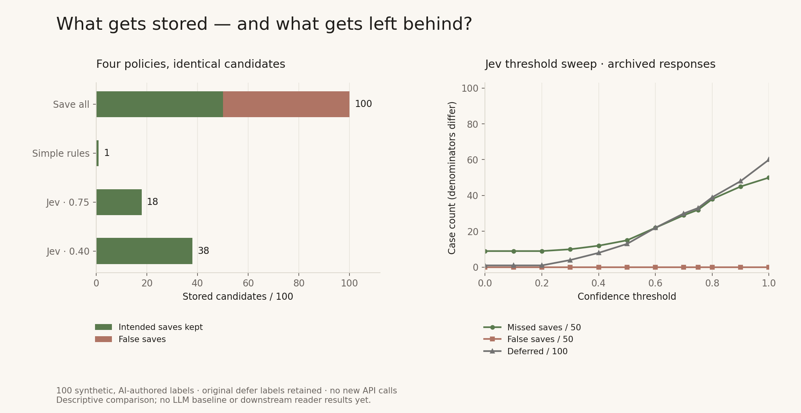

# Comparative memory admission: first results

The next phase compares admission policies, measures their tradeoffs, and prepares a controlled follow-up QA experiment. **The tables below are completed offline analyses of the original 100-case run. The general-purpose LLM comparison and downstream reader results have not been measured yet.**

[Protocol](PROTOCOL.md) · [Exact comparison data](offline-report.json) · [20 follow-up probes](../../fixtures/downstream-v1.json)

## Same 100 candidates, four policies

| Policy | Matches | False saves | Missed saves | Defer | Save precision | Save recall |
|---|---:|---:|---:|---:|---:|---:|
| save-all | 50/100 | 50/50 | 0/50 | 0 | 50.0% | 100.0% |
| rules-v1 | 25/100 | 0/50 | 49/50 | 85 | 100.0% | 2.0% |
| jev-0.75 | 59/100 | 0/50 | 32/50 | 33 | 100.0% | 36.0% |
| jev-0.4 | 78/100 | 0/50 | 12/50 | 8 | 100.0% | 76.0% |

False saves use the 50 non-save labels as denominator; missed saves use the 50 save labels. A zero observed false-save count on this synthetic set is not a zero-risk guarantee. Rules-v1 is a basic lexical control, not an optimized competitor. Jev rows replay the same published responses; local rule execution is not an API-latency comparison. All labels remain as authored, including disputed defer labels.

## Sensitivity: exclude the 10 disputed defer labels

| Policy | Matches | False saves | Missed saves | Defer | Save precision | Save recall |
|---|---:|---:|---:|---:|---:|---:|
| save-all | 50/90 | 40/40 | 0/50 | 0 | 55.6% | 100.0% |
| rules-v1 | 15/90 | 0/40 | 49/50 | 75 | 100.0% | 2.0% |
| jev-0.75 | 58/90 | 0/40 | 32/50 | 32 | 100.0% | 36.0% |
| jev-0.4 | 78/90 | 0/40 | 12/50 | 8 | 100.0% | 76.0% |

This diagnostic excludes the entire original defer class without changing any label. It cannot establish whether a model defers appropriately. See the [boundary audit](../../docs/decision-boundary.md).

## Threshold tradeoff, unchanged Jev responses

| Threshold | Saved | False saves | Missed saves | Defer | Resolved coverage |
|---|---:|---:|---:|---:|---:|
| 0.00 | 41 | 0 | 9 | 1 | 99.0% |
| 0.10 | 41 | 0 | 9 | 1 | 99.0% |
| 0.20 | 41 | 0 | 9 | 1 | 99.0% |
| 0.30 | 40 | 0 | 10 | 4 | 96.0% |
| 0.40 | 38 | 0 | 12 | 8 | 92.0% |
| 0.50 | 35 | 0 | 15 | 13 | 87.0% |
| 0.60 | 28 | 0 | 22 | 22 | 78.0% |
| 0.70 | 21 | 0 | 29 | 30 | 70.0% |
| 0.75 | 18 | 0 | 32 | 33 | 67.0% |
| 0.80 | 12 | 0 | 38 | 39 | 61.0% |
| 0.90 | 5 | 0 | 45 | 48 | 52.0% |
| 1.00 | 0 | 0 | 50 | 60 | 40.0% |

Resolved coverage is the proportion receiving save or skip. It is distinct from save recall. Full confusion matrices and resolved error rates are retained in the JSON. Sweeps are descriptive; no new default threshold is selected.

## Downstream experiment

Twenty frozen multiple-choice follow-ups ask the same reader to answer with only the memories admitted by each policy. Controls include no memory and original-source context. We distinguish correct answers, justified unknowns, missed answers and wrong answers. Identical reader requests are shared between policies, so arm rows do not become extra independent samples. The design uses one candidate per isolated session and does not test a full memory store or free-form tasks. **No downstream improvement claim is supported until the reader run completes.**

## Reproduce

Run `node scripts/compare.mjs` for the tables without credentials or API use. Live comparison requires `TYPESAFE_API_KEY` and `OPENROUTER_API_KEY` in a local environment file:

`node --env-file=.env scripts/compare.mjs --live`

The live command reruns 100 Jev evaluations, performs 100 Qwen3-8B gate calls, and up to 60 Qwen3-8B reader calls. It stops on the first error, does not retry automatically, and checkpoints into ignored `runs/`. The model is frozen in the protocol. Both providers may charge for live calls. No production memories are written. Do not upload your environment file.

The [research notes](../../docs/research-directions.md) explain how this experiment relates to earlier work.
